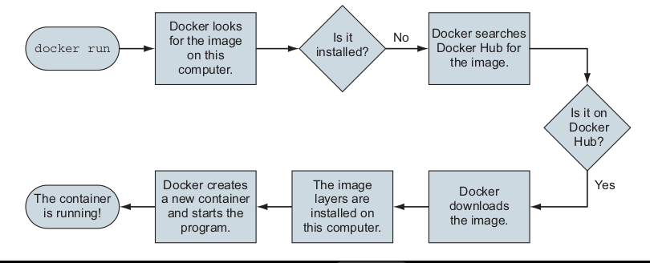

# Running Your First Docker Container

## Command to run:

```bash
docker run dockerinaction/hello_world
```

### What happens under the hood when we run "docker run" command?
- Docker starts and downloads necessary components.
- Eventually, it prints: hello world
- If you run the command again: It directly prints hello world without downloading again.

### Key points about the command:
- docker run triggers Docker to start a container.
- The command sequence installs and runs a program inside a container.

This process is illustrated in figure 1.1 .


figure 1.1 
